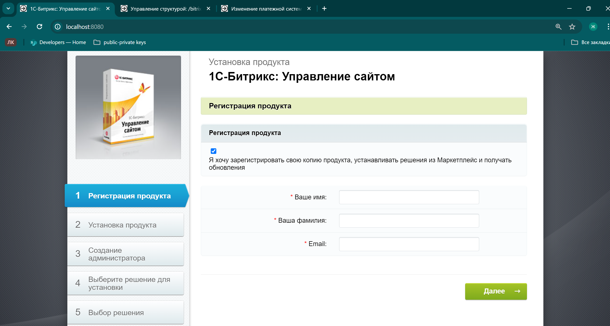
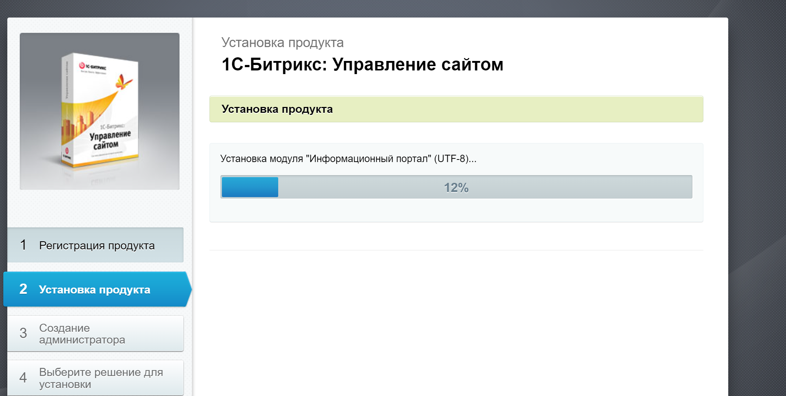
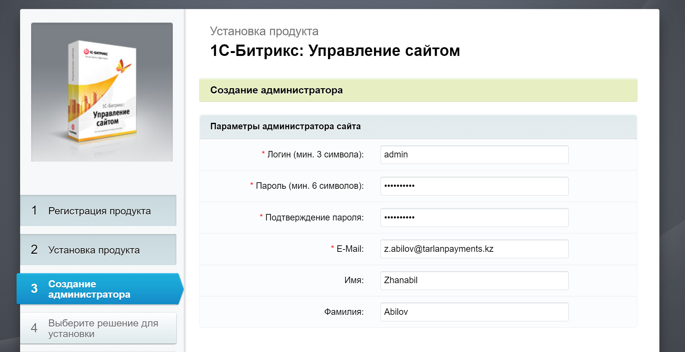
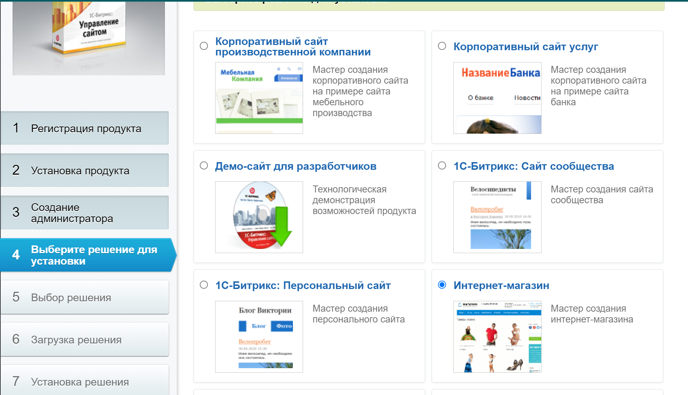
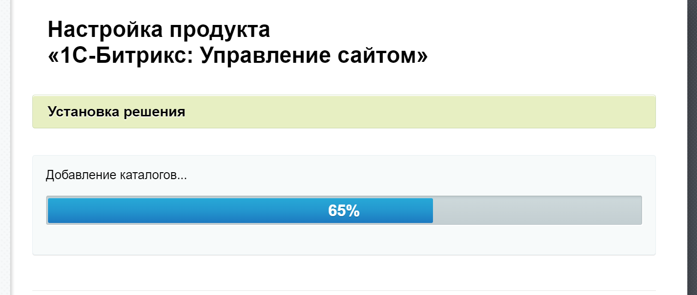
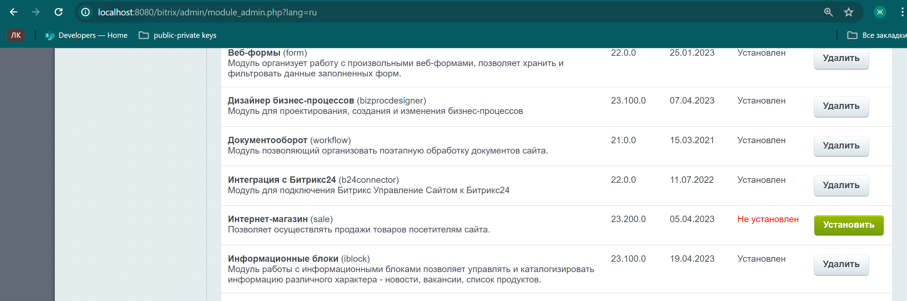
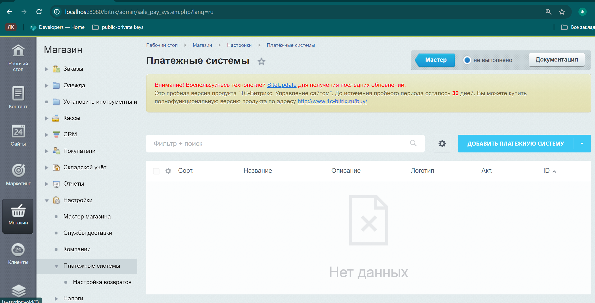
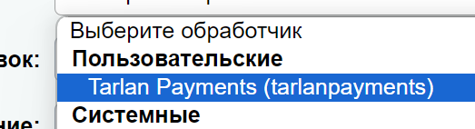
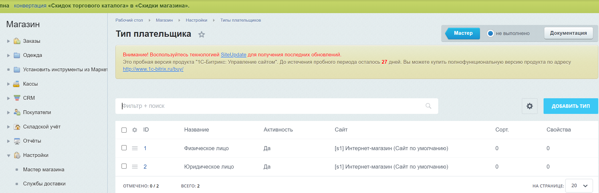
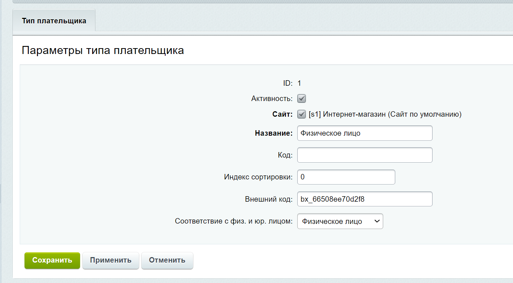

1C-Bitrix. Управление сайтом

Основная цель, преследуемая при интеграции с 1С-Битрикс - это создать готовое решение для дальнейшей возможности ее интеграции другими сайтами.

1С-Битрикс - это инструмент для создания сайтов, интернет-магазинов на своей платформе.


## Модуль оплаты TarlanPayments для 1C-Битрикс

## Запуск магазина для теста платежной системы
Открыть терминал для выполнения команд по очереди 
```bash 
docker-compose build

docker-compose up -d
```

Сразу после открываем браузер и вводим туда *localhost:8080*

Вы получите стартовое окно по установке 1с-битрикса через имеющийся дистрибутив (https://www.1c-bitrix.kz/download/business_encode.tar.gz)

```
Важно учесть, чтобы протестировать платежную систему, необходимо установить именно "Бизнес" пакет (При развертывании проекта самостоятельно можно выбрать
пакет в заисимости от целей от "Старт" до "Энтерпрайз"). Это необходимо для того, чтобы установить недостающие модули/компоненты, которые доступны только для 
определенных версий пакетов, такие как "Корзина", "Настройка магазина", "Платежные системы" и тд.
```

У вас появится вот такое окно на вкладке "Регистрация продукта":


Вводим любые регистрационные данные и нажимаем на "Далее".
Начется установка главного модуля в пункте "Установка продукта":



При завершении установки вас перебросит на панель "Создание администратора". Это важный момент, т.к доступ в административную панель,
о которой речь пойдет далее, открывается только после успешной авторизации. Не забудьте логин и пароль (Пример: login: admin; password: adminadmin)


Нажимаем "Далее" и получаем переход на вкладку "Выберите решение для установки".

Необходимо выбрать "Интернет-магазин" и нажать "Далее".

Следом идет кастомизация вашего интернет-магазина. Если это важно для вас, можете настроить по своему вкусу, для остальных - просто жмите "Далее" до победного.
"До победного" означает, что начнется установка решения:


При завершении нажмите на "Перейти на сайт->"

Поздравляю, большая часть завершена. Осталось совсем чуть-чуть.
У вас на самой верхней части сайта серым будет доступна настройка магазина. Для версии битрикс модуля 23.0 на ней находятся две основные вкладки "Сайт" и "Администрирование"
Необходимо нажать на "Администрирование" и перейти к "Настройки" -> "Настройки продукта" -> "Модули".

Ссылка сверху будет приблизительно такой:
http://localhost:8080/bitrix/admin/module_admin.php?lang=ru

Пролистните вниз, пока не найдете модуль с наименованием "Интернет-магазин"

Статус которого будет подсвечен красным "Не установлен". 
Нажмите кнопку "Установить" рядом и на "Установить модуль" в окне без галочки на публичную директорию.

Далее идет наконец настройка платежной системы Tarlan Payments.
Переходим в "Администрирование" -> "Магазин" -> "Настройки" -> "Платежные системы"


Справа видно синим подсвечена кнопка "Добавить платежную систему". Нажав на нее откроется основной обработчик платежных систем магазина.
На данном этапе можно выбрать любую платежную систему и добавить необходимые для ее работы параметры. 
Для этого в меню "Выберите обработчик" пункта "Обработчик" найдите Tarlan Payments 

Выбрав Tarlan Payments ниже вы найдете раздел, наименованный "Настройка обработчика ПС".
Здесь необходимо указать основные параметры проекта в системе Tarlan Payments

Тестовые данные для проведения запроса в sandbox среду.
```
ID проекта: 379
ID мерчанта: 377
Ключ проекта: 48BKhqm9bpk7LVZvGd5j
Адрес на отправку запроса для создания транзакции на стороне Tarlan Payments: /transaction/api/v1/cms/primal/bitrix-pay-in
Домен на тестовую среду системы TarlanPayments: https://sandboxapi.tarlanpayments.kz
Домен на продакшен среду системы TarlanPayments: https://prapi.tarlanpayments.kz
URL для успешной переадресации: http://localhost:8080/bitrix/tools/sale_ps_success.php
URL для неуспешной переадресации: ttp://localhost:8080/bitrix/tools/sale_ps_fail.phph
Webhook URL для получения состояния платежа: http://localhost:8080/bitrix/tools/sale_ps_result.php
```

Последний пункт: создание типов плательщиков - http://localhost:8080/bitrix/admin/sale_person_type.php?lang=ru


Здесь все просто, указывается привязанность типа плательщика в соответствие с физ. или юр. лицом.


Данный тип настройки индивидуальный для магазина, однако для простоты теста будут указаны 2 типа с идентичными наименованиям.

При настройке пункта "Настройка обработчика ПС" можно выбрать для каждого типа плательщика свои настройки. Если их же их не трогать, то
будут применены дефолтные (по умолчанию) настройки ПС.

Готово. Можете снова вернуться к магазину, нажав сверху на "Сайт" и попытаться добавить что-нибудь в корзину, а затем оплатить.

````
Внимание: для теста платежной системы на вашем сайте необходимо будет заменить пункт "http://localhost:8080"
на действительный адрес вашего сайта. Например поле для успешной переадресации будет иметь следующий вид:

URL для успешной переадресации: https://mysite.com/bitrix/tools/sale_ps_success.php
````

## Установка модуля
Создайте резервную копию вашего магазина и базы данных. 

Скачайте архив модуля bitrix-tarlanpayments.zip или bitrix-tarlanpayments-windows-1251.zip, если у вас 1С-Битрикс запущен в кодировке Windows-1251

Распакуйте архив и скопируйте каталог tarlanpayments в каталог <1C-Bitrix/bitrix/modules/

Зайдите в зону 1C-Битрикс администратора и выберите меню Marketplace -> Установленные решения

Установите модуль Модуль оплаты tarlanpayments. Будет создана платежная система с обработчиками.


## Настройка модуля

Зайдите в зону 1C-Битрикс администратора и выберите меню Магазин -> Настройки -> Платёжные системы

Добавьте и настройте платёжную систему с обработчиком tarlanpayments

Введите в полях "Домен на продакшен среду системы TarlanPayments:", "Домен на тестовую среду системы TarlanPayments", "Адрес на отправку запроса для создания транзакции на стороне Tarlan Payments"
"ID проекта", "ID мерчанта", "Ключ проекта" значения, полученные от вашей платежной компании

Укажите в Webhook URL для получения состояния платежа, по которому отправится информация о состоянии платежа при попытке проведения

Укажите в URL для успешной переадресации, куда будет перенаправлен покупатель в случае успешной оплаты.

Укажите в URL для неуспешной переадресации, куда будет перенаправлен покупатель в случае неуспешной оплаты.

Нажмите Сохранить